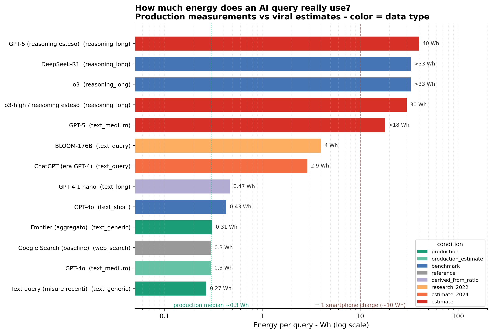

# AI energy consumption: estimates vs measured

A short analysis of a small curated dataset (19 rows) on the energy cost of AI
inference. The question: how far apart are the widely-cited estimates for a single
AI query and the numbers actually measured in production?

Short answer: quite far. A standard text query lands around 0.3 Wh in recent
production measurements, while the estimates that circulated in 2024 sit several
times higher. The values that really stand out are not "AI" in general but
long-reasoning models, which generate thousands of tokens per answer.

## Contents

| Path | Description |
|------|-------------|
| `ai_energy_analysis.ipynb` | The analysis: data prep, three sections, one chart. |
| `data/ai_energy_consumption_dataset.csv` | The dataset, 19 rows. |
| `figures/ai_energy_per_query_log.png` | Exported chart. |

## Dataset

One row per measurement or estimate. The columns that do the work:

- `metric` — the unit of `value_wh`: `wh_per_query`, `wh_per_token`, `wh_per_image`,
  or `ratio_note`. Rows with different metrics are never compared directly.
- `condition` — how the number was obtained: `production` / `production_estimate`,
  `benchmark` / `benchmark_measured`, `estimate` / `estimate_2024` / `research_2022`,
  `derived_from_ratio`, `reference`, `equivalence`. This is what separates measured
  numbers from estimated or derived ones.
- `value_wh` with `value_low_wh` / `value_high_wh` — the value and its bounds. Two
  rows are intentionally left blank (qualitative notes from papers with no reliable
  point value). Reasoning rows are encoded as lower bounds.
- `model`, `task_type`, `hardware`, `year`, `source`, `source_url`, `notes` —
  context and traceability.

## The three sections

1. **Estimates vs production.** ChatGPT 2024 (2.9 Wh) and BLOOM-176B (4 Wh) come out
   at 9.7x and 13.3x the production median (~0.3 Wh).
2. **Reasoning models.** `reasoning_long` tasks (o3, DeepSeek-R1, extended GPT-5:
   30–40 Wh) run ~100–130x the baseline. The driver is token count, not "thinking".
3. **Per-token cost and model size.** The two measured AutoWebGLM rows anchor the
   per-token figure; MELODI reports a ~100x ratio between large and small models,
   which is kept as a ratio rather than a hard number.

## Chart



`wh_per_query` rows on a log scale, colored by `condition`, with reference lines for
the production median and a ~10 Wh smartphone charge. Lower bounds are marked `>`.

## Notes on method

- Compare only within the same `metric`.
- Blank values stay blank — nothing is imputed.
- `derived_from_ratio`, `equivalence` and `ratio_note` are kept separate from
  measured benchmarks.
- Full sources are in the `source_url` column.

## Run

```bash
conda activate data_science   # pandas, numpy, matplotlib
jupyter lab                   # open the notebook and Run All
```

Running all cells reproduces the printout and regenerates the figure.
